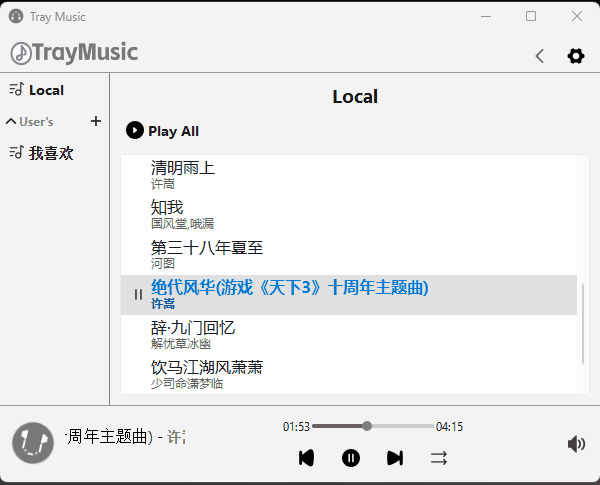
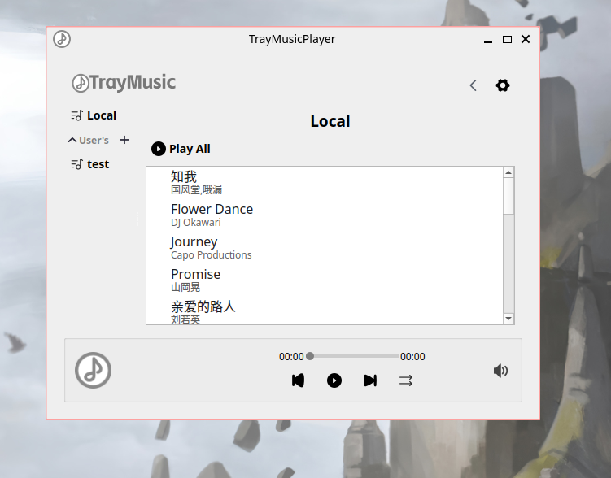

<p align="center">
  
  <h3 align="center">TrayMusicPlayer</h3>
  <p align="center">
    一个实现了播放列表管理和歌词文件解析的本地音乐播放器
  </p>
</p>

---

<p align="center">
  
  
  
</p>


## 运行
- 部分功能演示(Windows 11)  
  

- Linux(Arch linux with cosmic)  
    

## 快速使用
> - `本地目录添加` 点击右上角`设置`图标，添加本地音乐，点击`Local`按钮加载本地歌单
> - `lrc歌词文件` 除扩展名外应与音乐文件同名且位于同一目录

## 从源码构建
### 配置
- `C++ 17`
- `Qt6.5` 以上
- `CMake`

### Windows
- 配置
```shell
git clone --recurse-submodules https://github.com/leejkee/TrayMusicPlayer.git
cd TrayMusicPlayer
cmake -B build --preset windows-release -S .
```

- 编译并打包项目
```cmake
cmake --build build/windows-release --config Release --target package_release
```
> 最终在`build/windows-release`生成打包完成的`TrayMusicPlayer_Windows_Portable_v<version>.zip`

### Linux
```shell
git clone --recurse-submodules https://github.com/leejkee/TrayMusicPlayer.git
cd TrayMusicPlayer
cmake -B build --preset linux-release -S .
cmake --build build
```

## 资源文件
本项目 **`TrayIcon.svg`**, **`logo.svg`** 除外，其他svg资源均来自网络

## ToDo
- [x] 可扩展的设置页面嵌入
- [x] 内置lrc歌词解析支持
- [ ] 可贴边的浮动歌词支持
- [ ] 更美观的主题切换支持
- [ ] 更用户友好的随机数生成算法

