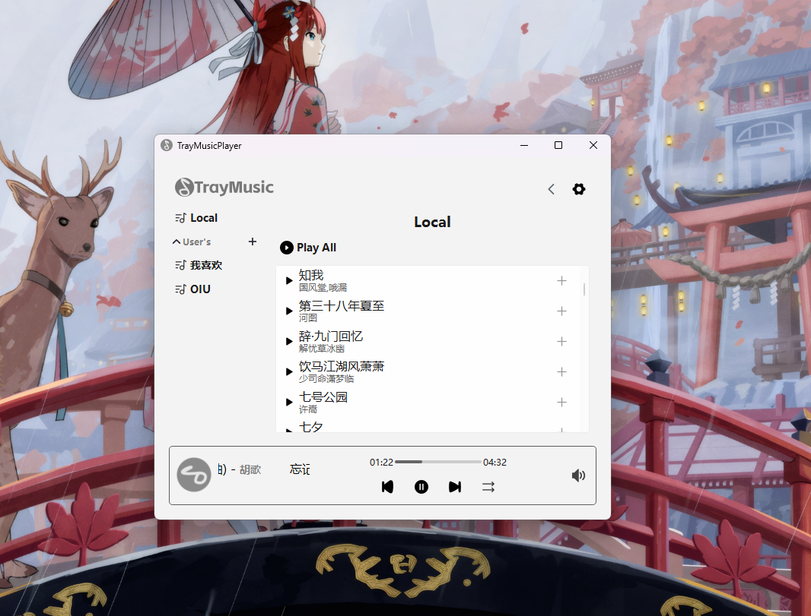
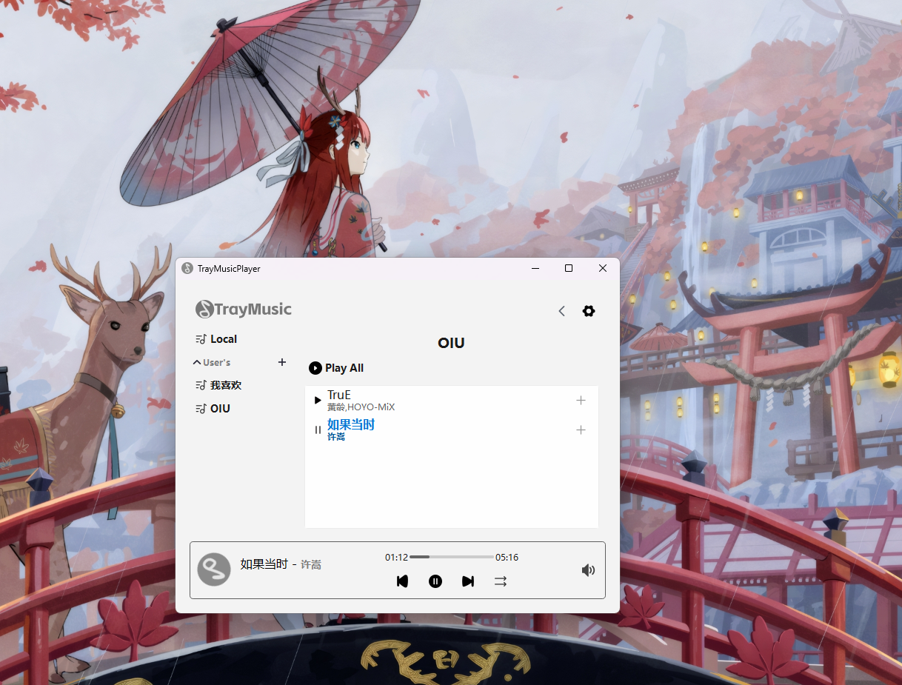

## TrayMusicPlayer 重制版
前后端分离，模块解耦，加入测试用例，目标是最终作为一个可用并且尽可能好用的音乐播放器
## 原项目[README](https://github.com/leejkee/TrayMusic)尚可参考

## 项目UML结构
- [主体框架](docs/UML/index.md)
- [后端结构](docs/UML/Core/Core.md)
- [主要功能流程](docs/UML/UI/WindowManager.md)

## Docs
- [后端功能概述](docs/Core.md)

## 运行截图（Windows11，Linux修bug中）开发中




## 构建本项目

### 1. 处理依赖
#### 下载依赖的源码
```shell
git submodule update --init --recursive
```

#### 构建

- 需要指定编译器和生成器自行修改`dependencies/CMakePresets.json`中的配置  
- tips: [taglib官方编译教程](https://github.com/taglib/taglib/blob/master/INSTALL.md)
  
- 示例：在windows上使用 `Mingw + Ninja` 编译
```shell
cd dependencies
# Windows
cmake -B build --preset window-base -S .
cmake --build build
```
如果不使用`--preset`选项指定`CMakePresets.json`则会使用`PATH`中的默认配置

- 示例：linux(linux-base未指定编译器，需要手动指定，否则则会在系统PATH中寻找)
```shell
cd dependencies
# Windows
cmake -B build --preset linux-base -S .
cmake --build build
```

### 2. 构建本项目

- 项目根目录的`CMakePresets.json`配置了编译器，生成器以及Qt6的位置
- 构建
```shell
cmake -B build --preset windows-mingw-debug -S .
cmake --build build
```