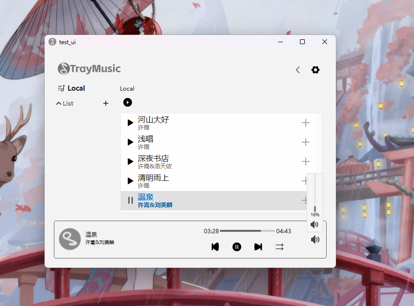

### TrayMusicPlayer 重制版
前后端分离，模块解耦，加入测试用例，目标是最终作为一个可用并且尽可能好用的音乐播放器
### 原项目[README](https://github.com/leejkee/TrayMusic)尚可参考

### 项目UML结构
- [主体框架](docs/UML/index.md)
- [后端结构](docs/UML/Core/Core.md)
- [主要功能流程](docs/UML/UI/WindowManager.md)

### Docs
- [后端功能概述](docs/Core.md)

### 运行截图（Windows11，Linux修bug中）开发中
