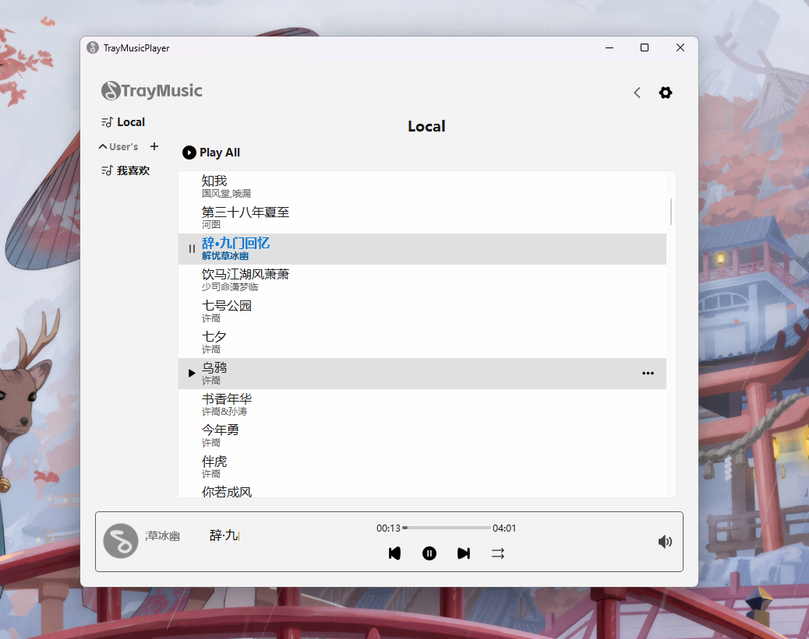
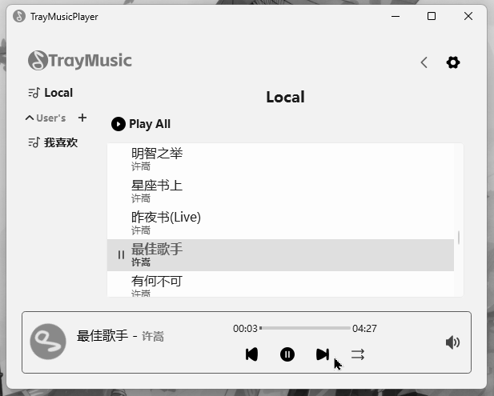

<p align="center">
  
  <h3 align="center">TrayMusicPlayer</h3>
  <p align="center">
    一个实现了播放列表管理并包含系统托盘的本地音乐播放器
  </p>
</p>

---

<p align="center">
  
  
  
</p>


## 运行截图（Windows11，Linux暂未测试）
- 主页面  
  
- 部分功能演示  
  

## 项目结构文档
- [主体框架图](docs/UML/index.md)
- [后端结构图](docs/UML/Core/Core.md)
- [后端功能文档](docs/Core.md)

## 构建本项目

### 环境需求
- C++ 17
- Qt6.5 以上
- CMake(Ninja generator)
- Git

### 1. 处理依赖
#### 下载依赖的源码
```shell
git submodule update --init --recursive
```

#### 构建

- 需要指定编译器和生成器自行修改`dependencies/CMakePresets.json`中的配置  
- tips: [taglib官方编译教程](https://github.com/taglib/taglib/blob/master/INSTALL.md)
  
- 示例：在windows上使用 `Mingw + Ninja` 编译
```shell
cd dependencies
# Windows
cmake -B build --preset window-base -S .
cmake --build build
```
如果不使用`--preset`选项指定`CMakePresets.json`则会使用`PATH`中的默认配置

- 示例：linux(linux-base未指定编译器，需要手动指定，否则则会在系统PATH中寻找)
```shell
cd dependencies
# Windows
cmake -B build --preset linux-base -S .
cmake --build build
```

### 2. 构建本项目

- 项目根目录的`CMakePresets.json`配置了编译器，生成器以及Qt6的位置
- 构建
```shell
cmake -B build --preset windows-mingw-debug -S .
cmake --build build
```

## 资源文件
本项目logo **`TrayMusic`** 除外，其他svg资源均来自网络，商用联系阿里巴巴矢量图标社区作者

## ToDo
- [ ] 可贴边的浮动歌词支持
- [ ] 更用户友好的随机数生成算法