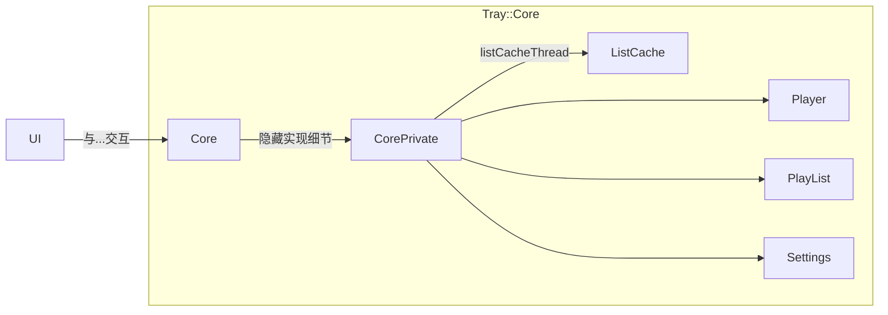

# Core 模块开发文档

## 1. 概述

`Tray::Core::Core` 是播放器的核心模块主类，负责构建一个完整的、支持播放列表功能的音频播放系统。该模块集成了音乐播放控制、播放列表管理、本地路径配置以及与 UI 层的交互逻辑。

`Core` 类继承自 `QObject`，使用 Qt 的信号与槽机制实现模块间通信，并采用 Pimpl（Pointer to Implementation）模式将内部实现细节封装在 `CorePrivate` 类中，以提高接口稳定性与编译隔离性。

---

## 架构概览

### 主要组件

| 组件                | 说明                                      |
|-------------------|-----------------------------------------|
| `Player`          | 负责音频播放控制，播放/暂停、音量调节                     |
| `PlayList`        | 提供播放列表的数据结构及操作接口，维护播放列表循环，下一曲/上一曲       |
| `ListCache`       | 缓存播放列表数据，提升访问效率，减少磁盘 I/O，运行在独立线程，避免阻塞Ui |
| `Settings`        | 维护用户配置，用户修改配置后及时更新到配置文件，在应用启动阶段提供配置内容   |
| `DatabaseManager` | 封装了必要的SQL操作的工具类，使用时创建，使用后及时释放不占用资源      |
| `CorePrivate`     | `Core` 的私有实现类，头文件中隐藏实现并隔离特有依赖           |

---

## 2. 架构

`Tray::Core` 模块在设计时考虑了职责分离，利用了 **PIMPL (Pointer to IMPLementation)** 惯用法来隐藏内部复杂性并维护稳定的 API。

* **`Core` 类**: 统一管理各个模块，ui和各个模块通信需要使用core提供的信号函数和槽函数
* **`CorePrivate` 类**: 初始化成员，隐藏实现细节，避免向接口头文件`Core.h`引入额外依赖
* **内部组件**:
    * **`Player`**: 负责实际的音频播放，包括管理音频引擎、音量控制和播放状态（播放、暂停、停止）。
    * **`PlayList`**: 管理活动的音乐队列，处理添加、删除和重新排序歌曲等操作。与 `ListCache` 交互以持久化和检索播放列表数据。
    * **`ListCache`**: 处理用户定义播放列表以及本地音乐路径的持久化和检索。
    * **`Settings`**: 维护用户配置项，并热更新用户的修改。

---

## 3. 已实现的 API (公共接口)

`Tray::Core::Core` 类公开了以下公共方法（API）用于交互：

### 3.1. 构造函数与析构函数

* `explicit Core(QObject *parent = nullptr)`: 构造 `Core` 实例。
* `~Core() override`: 销毁 `Core` 实例并清理资源。

### 3.2. 初始化

* `void initWork()`: 启动listCacheThread线程，初始化core，以发送信号的形式通知ui使用用户配置。应在`core`对象和`ui`对象创建后调用。

### 3.3. 播放控制槽

* `void setVolume(unsigned int volume)`: 设置播放音量。
* `void playToggle()`: 播放/暂停。
* `void playToggleWithListAndIndex(const QString &listKey, int index)`: 根据信号来源决定是否切换到指定列表播放指定序号的音乐，可以仅切换同一首音乐的播放/暂停
* `void nextMusic()`: 依据播放模式下一曲
* `void preMusic()`: 依据播放模式上一曲。
* `void setPlayerPosition(qint64 position)`: 设置音乐的当前播放位置。
* `void changePlayMode()`: 循环切换可用的播放模式（例如：随机播放、全部重复、单曲重复）。

### 3.4. 播放列表管理槽

* `void requestPlaylist(const QString &key)`: 请求由 `key` 标识的特定播放列表，ui希望显示歌曲列表给用户。
* `QStringList getKeysOfUserPlaylist()`: 返回所有用户定义播放列表的键（标识符）列表。
* `void addUserPlaylist(const QString &key)`: 添加一个以给定 `key` 命名的新空用户定义播放列表，成功则通知ui创建新的切换ui按钮
* `void removeUserPlaylist(const QString &key)`: 删除由 `key` 标识的用户定义播放列表，成功则通知ui删去key的切换按钮。
* `QStringList getLocalMusicPaths()`: 返回本地音乐文件所在路径的列表。
* `void appendLocalMusicPath(const QString &path)`: 将新的本地音乐路径添加到应用程序的扫描目录中，通知ui修改内容。
* `void removeLocalMusicPath(const QString &path)`: 从应用程序的扫描目录中移除一个本地音乐路径，通知ui修改内容。
* `void addMusicToList(const QString &sourceListKey, const QString &destinationListKey, int index)`: 
  将index序号的音乐从源列表添加到目标列表的特定索引处。
* `void removeMusicFromList(const QString &key, const QString &songTitle)`: 从由 `key` 标识的播放列表中移除标题为 `songTitle` 的音乐。

### 3.5. 信号

* `void signalNotifyUiPlayingStatusChanged(bool b)`: 当播放状态（播放中/暂停）改变时发出。`b` 为 `true` 表示播放中，`false` 表示暂停，通知ui修改icon。
* `void signalNotifyUiCurrentMusicChanged(int index, const QString &title, int duration)`: 当当前播放的音乐改变时发出。提供列表中的 `index`、歌曲 `title` 和其 `duration`。
* `void signalIsMuted(bool)`: 音量变化时发出表示是否静音，通知ui修改icon。
* `void signalPositionChanged(qint64 position)`: 更新音乐的当前播放位置，通知ui修改进度条位置。
* `void signalNotifyUiPlayModeChanged(int mode)`: 当播放模式改变时发出，通知ui修改icon。
* `void signalPlaylistSwitched(const QString &key, const QStringList &titleList)`: 当激活的播放列表切换时发出。提供新播放列表的 `key` 及其歌曲 `titleList` 的 `QStringList`。
* `void signalNotifyUiUserKeySetsChanged(const QStringList &list)`: 当用户定义播放列表键集改变时发出。
* `void signalPlaylistModified(const QString &key, const QStringList &list)`: 当特定播放列表（由 `key` 标识）被修改时发出，提供其歌曲 `list` 的更新列表。
* `void signalNotifyUiCurrentListKeyChanged(const QString &key)`: 
  通知ui表示正在播放的列表已经切换，注意渲染时部分特效的可见性（比如仅在viewWidget渲染的是当前正在播放的列表，才会显示正在播放的音乐项的特殊qss）。
* `void signalCopyMusicFromListToList(const QString &sourceKey, const QString &destinationKey, int index)`: 
  指定音乐已从一个播放列表复制到另一个播放列表。
* `void signalRemoveMusicFromList(const QString &key, const QString &title)`: 以标题指定歌曲从播放列表中移除。
* `void signalRemoveUserPlaylistFromCache(const QString &key)`: 请求 `ListCache` 移除一个用户播放列表。
* `void signalAddUserPlaylistToCache(const QString &chars)`: 请求 `ListCache` 添加一个用户播放列表。
* `void signalRequestTitleList(const QString &key)`: 请求 `ListCache` 提供给定播放列表键的歌曲列表的标题，用于在ui显示。
* `void signalRequestSwitchPlaylistAndPlayIndex(const QString &key, int index)`: 请求 `ListCache` 切换到播放列表并从特定索引开始播放。
* `void signalNotifyUiToRemoveUserPlaylist(const QString &key)`: 通知 UI 从其显示中移除用户播放列表。
* `void signalNotifyUiToAddUserPlaylist(const QString &key)`: 通知 UI 向其显示添加新的用户播放列表。
* `void signalNotifyUiToUpdateLocalPaths(const QStringList &list)`: 通知 UI 更新显示的本地音乐路径列表。
* `void signalSendUiCurrentTitleList(const QString &key, const QStringList &list)`: 将特定播放列表的标题列表发送给 UI。
* `void signalNotifyUiCacheModified(const QString &key, const QStringList &list)`: 通知 UI 特定播放列表的缓存已修改。
* `void signalInitUiDefaultSettings(const QStringList &localList, const QStringList &userKeys, unsigned volume)`: 在启动时向 UI 提供初始默认设置，包括本地音乐路径、用户播放列表键和当前音量。

---