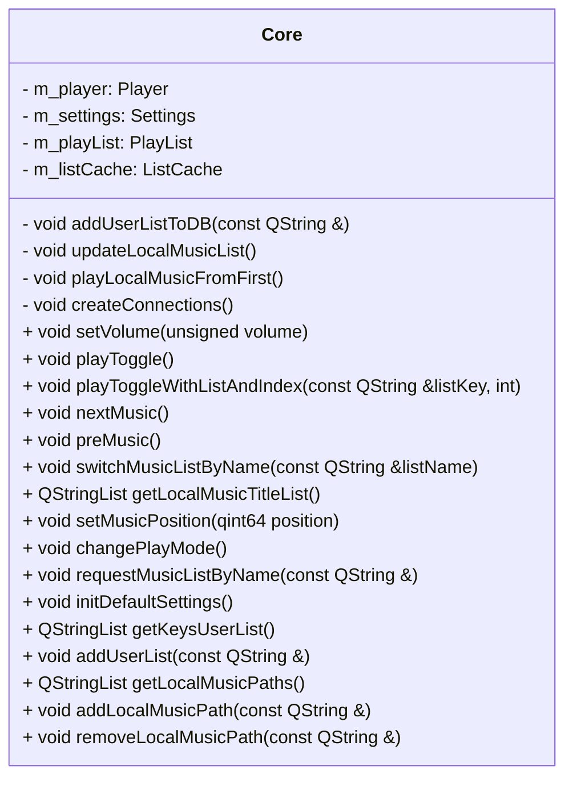
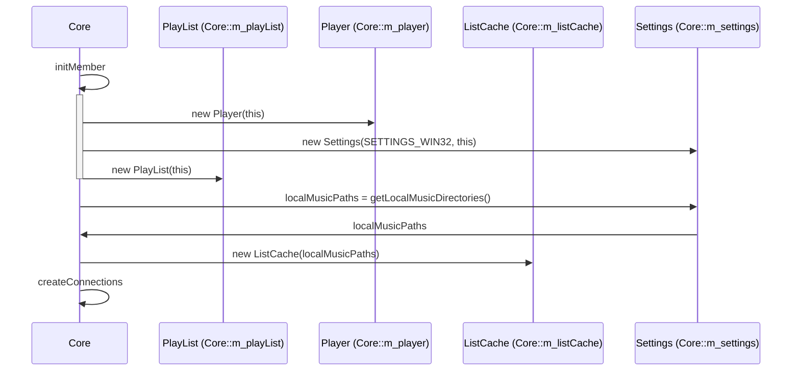

## Core类

```mermaid
classDiagram
class Core {
    - m_player: Player
    - m_settings: Settings
    - m_playList: PlayList
    - m_listCache: ListCache

    - void addUserListToDB(const QString &)
    - void updateLocalMusicList()
    - void playLocalMusicFromFirst()
    - void createConnections()

    + void setVolume(unsigned volume)
    + void playToggle()
    + void playToggleWithListAndIndex(const QString &listKey, int) 
    + void nextMusic() 
    + void preMusic() 
    + void switchMusicListByName(const QString &listName) 
    + QStringList getLocalMusicTitleList() 
    + void setMusicPosition(qint64 position) 
    + void changePlayMode() 
    + void requestMusicListByName(const QString &) 
    + void initDefaultSettings() 
    + QStringList getKeysUserList() 
    + void addUserList(const QString &) 
    + QStringList getLocalMusicPaths() 
    + void addLocalMusicPath(const QString &) 
    + void removeLocalMusicPath(const QString &) 
}
```
## 序列图
### Core初始化流程

```mermaid
sequenceDiagram
    participant Core
    participant m_playList as PlayList (Core::m_playList)
    participant m_player as Player (Core::m_player)
    participant m_listCache as ListCache (Core::m_listCache)
    participant m_settings as Settings (Core::m_settings)

    Core ->> Core: initMember
    activate Core
        Core ->> m_player: new Player(this)
        Core ->> m_settings: new Settings(SETTINGS_WIN32, this)
        Core ->> m_playList: new PlayList(this)
    deactivate Core
    Core ->> m_settings: localMusicPaths = getLocalMusicDirectories()
    m_settings ->> Core: localMusicPaths
    Core ->> m_listCache: new ListCache(localMusicPaths)
    Core ->> Core: createConnections


```

