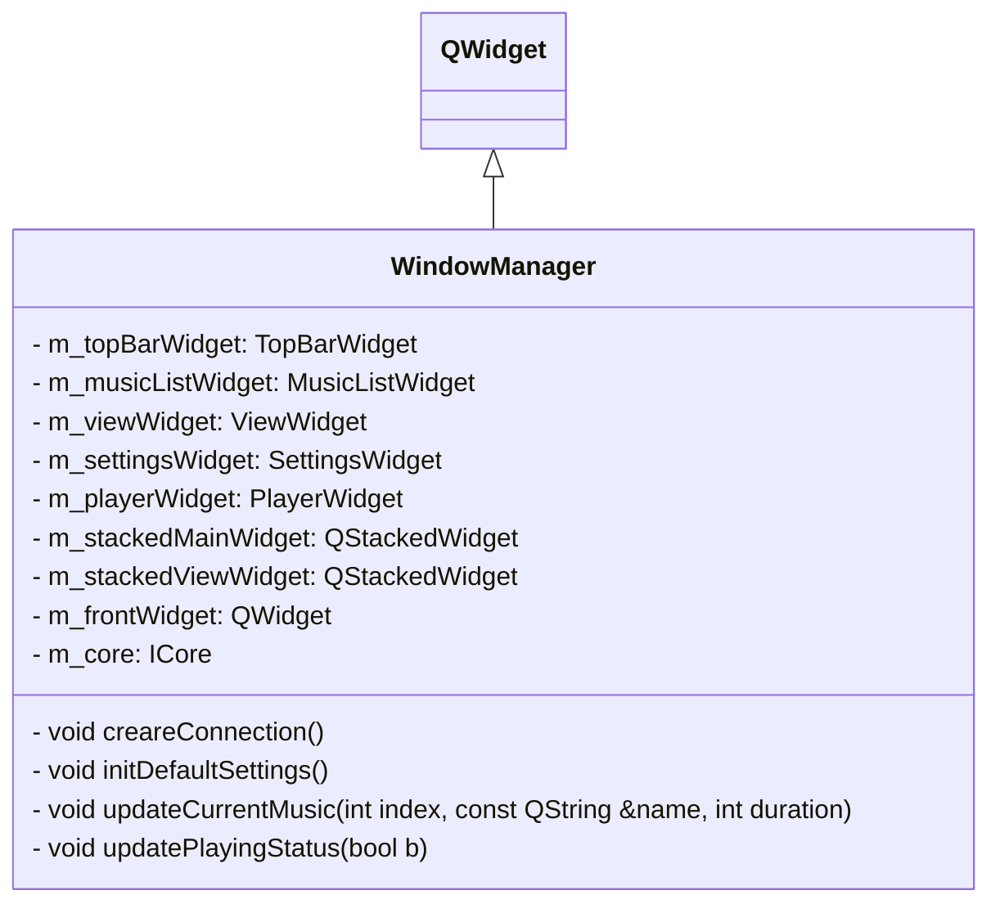
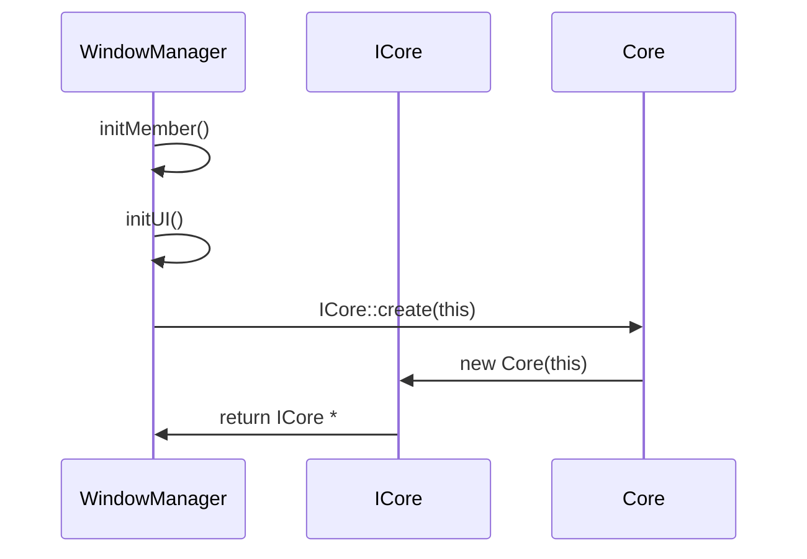
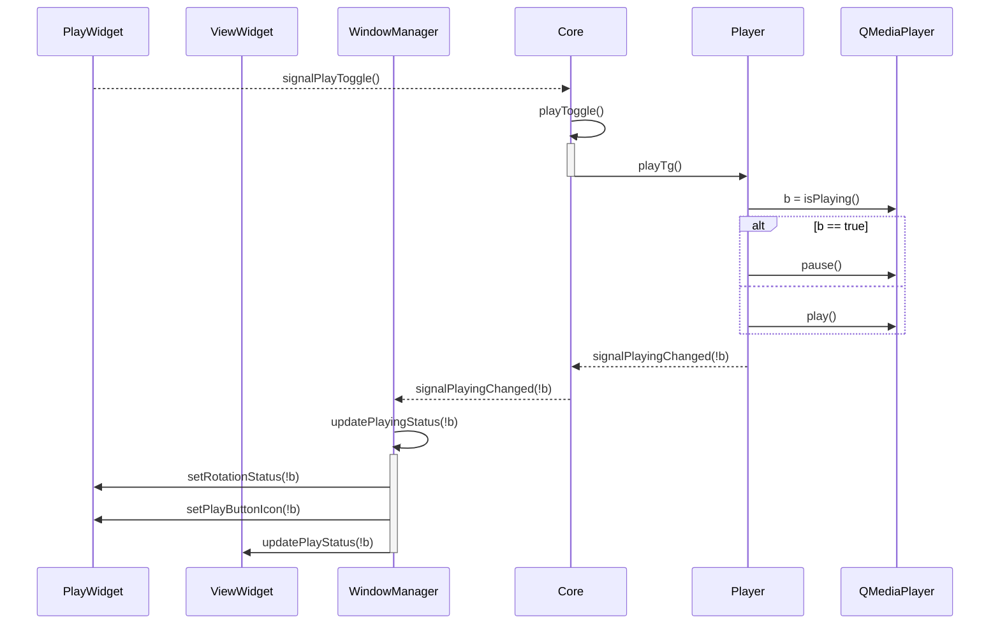
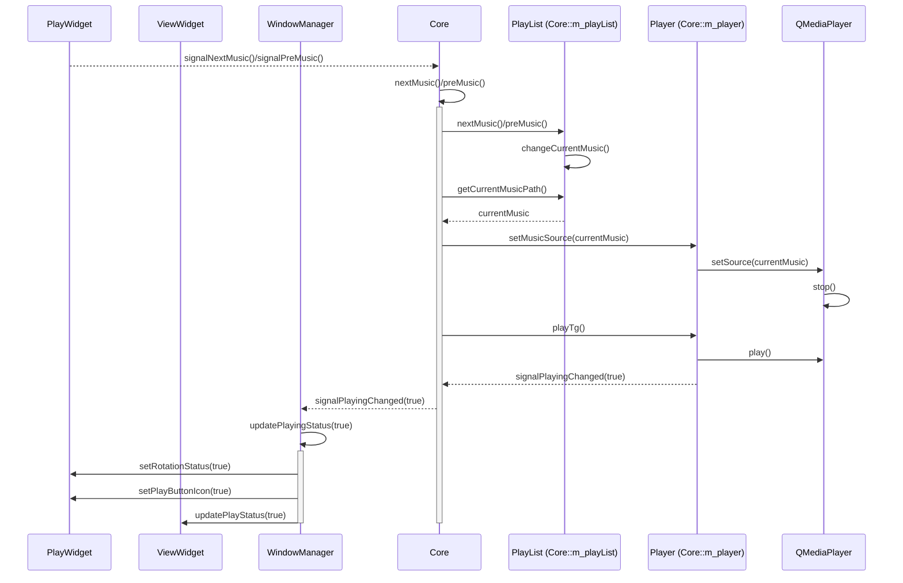
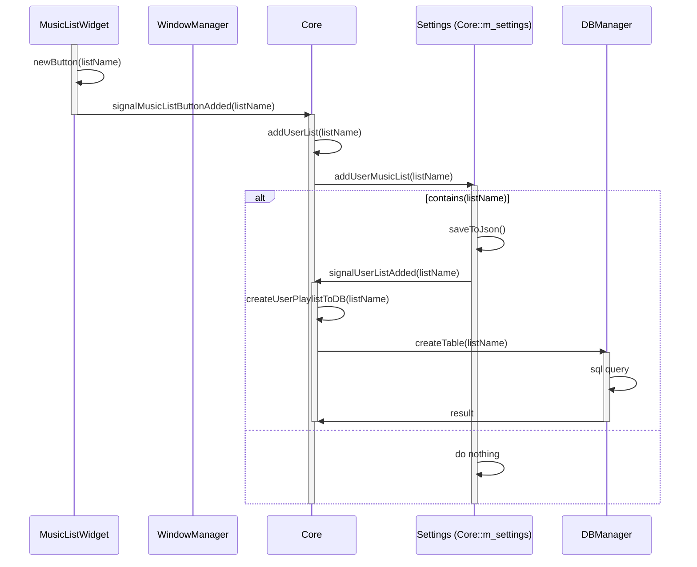
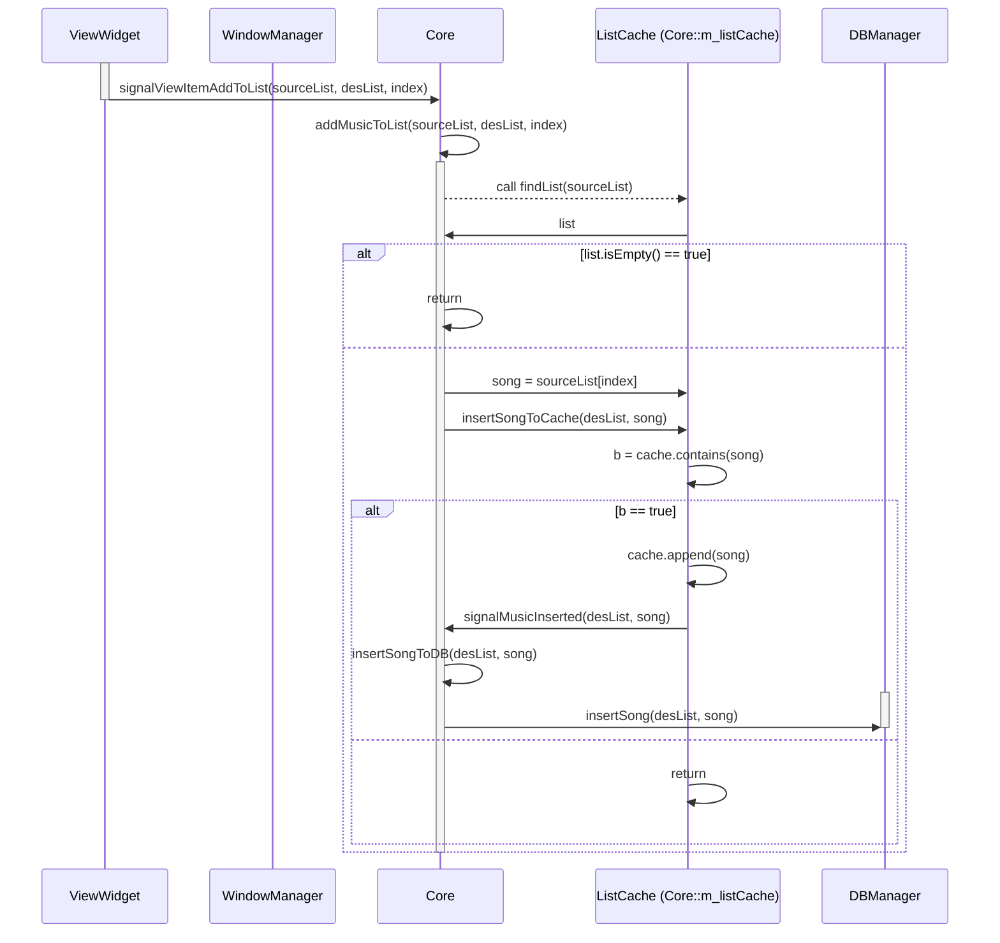

## WindowManager类

```mermaid
classDiagram

class WindowManager {
    - m_topBarWidget: TopBarWidget 
    - m_musicListWidget: MusicListWidget
    - m_viewWidget: ViewWidget
    - m_settingsWidget: SettingsWidget
    - m_playerWidget: PlayerWidget
    - m_stackedMainWidget: QStackedWidget
    - m_stackedViewWidget: QStackedWidget
    - m_frontWidget: QWidget
    - m_core: ICore 

    - void creareConnection()
    - void initDefaultSettings()
    - void updateCurrentMusic(int index, const QString &name, int duration)
    - void updatePlayingStatus(bool b)
}
QWidget <|-- WindowManager 
```

## 构造序列图

```mermaid
sequenceDiagram
    participant WindowManager
    participant ICore
    participant Core

    WindowManager ->> WindowManager: initMember()
    WindowManager ->> WindowManager: initUI()
    WindowManager ->> Core: ICore::create(this)
    Core ->> ICore: new Core(this)
    ICore ->> WindowManager: return ICore *

```

## 功能序列图

### PlayWidget

#### 播放/暂停

```mermaid
sequenceDiagram
    participant PlayWidget
    participant ViewWidget 
    participant WindowManager 
    participant Core
    
    
    PlayWidget -->> Core: signalPlayToggle()
    Core ->> Core: playToggle()
    activate Core
        Core ->> Player: playTg()
    deactivate Core
    Player ->> QMediaPlayer: b = isPlaying()
    alt b == true
        Player ->> QMediaPlayer: pause()
    else
        Player ->> QMediaPlayer: play()
    end
    Player -->> Core: signalPlayingChanged(!b)
    Core -->> WindowManager: signalPlayingChanged(!b)
    WindowManager ->> WindowManager: updatePlayingStatus(!b)
    activate WindowManager
        WindowManager ->> PlayWidget: setRotationStatus(!b)
        WindowManager ->> PlayWidget: setPlayButtonIcon(!b)
        WindowManager ->> ViewWidget: updatePlayStatus(!b)
    deactivate WindowManager
```

#### 上一曲/下一曲

```mermaid
sequenceDiagram
    participant PlayWidget
    participant ViewWidget 
    participant WindowManager 
    participant Core
    participant m_playList as PlayList (Core::m_playList)
    participant m_player as Player (Core::m_player)
    
    
    PlayWidget -->> Core: signalNextMusic()/signalPreMusic()
    Core ->> Core: nextMusic()/preMusic()
    activate Core
        Core ->> m_playList: nextMusic()/preMusic()
        m_playList ->> m_playList: changeCurrentMusic()
        Core ->>m_playList: getCurrentMusicPath()
        m_playList -->> Core: currentMusic 
        Core ->> m_player: setMusicSource(currentMusic)
        m_player ->> QMediaPlayer: setSource(currentMusic)
        QMediaPlayer ->> QMediaPlayer: stop()
        Core ->> m_player: playTg()
        m_player ->> QMediaPlayer: play()
        m_player -->> Core: signalPlayingChanged(true)
        Core -->> WindowManager: signalPlayingChanged(true)
        WindowManager ->> WindowManager: updatePlayingStatus(true)
        activate WindowManager
            WindowManager ->> PlayWidget: setRotationStatus(true)
            WindowManager ->> PlayWidget: setPlayButtonIcon(true)
            WindowManager ->> ViewWidget: updatePlayStatus(true)
        deactivate WindowManager
    deactivate Core


```
#### 创建一个歌单

```mermaid
sequenceDiagram

    participant MusicListWidget 
    participant WindowManager 
    participant Core
    participant m_settings as Settings (Core::m_settings)
    participant dbConnection as DBManager


    activate MusicListWidget
        MusicListWidget ->> MusicListWidget: newButton(listName)
        MusicListWidget ->> Core: signalMusicListButtonAdded(listName)
    deactivate MusicListWidget

    activate Core
        Core ->> Core: addUserList(listName)
        Core ->> m_settings: addUserMusicList(listName)
        activate m_settings
        alt contains(listName)
            m_settings ->> m_settings: saveToJson()
            m_settings ->> Core: signalUserListAdded(listName)
            activate Core
                Core ->> Core: createUserPlaylistToDB(listName)
                Core ->> dbConnection: createTable(listName)
                activate dbConnection
                    dbConnection ->> dbConnection: sql query
                    dbConnection ->> Core: result
                deactivate dbConnection
            deactivate Core
        else
            m_settings ->> m_settings: do nothing
        end
        deactivate m_settings
    deactivate Core

```

# todo
#### 将当前歌单的一首歌加入指定的其他歌单

```mermaid
sequenceDiagram
    participant ViewWidget 
    participant WindowManager 
    participant Core
    participant m_listCache as ListCache (Core::m_listCache)
    participant dbConnection as DBManager


    activate ViewWidget
        ViewWidget ->> Core: signalViewItemAddToList(sourceList, desList, index)
    deactivate ViewWidget
    
    Core ->> Core: addMusicToList(sourceList, desList, index)
    activate Core
        Core -->> m_listCache: call findList(sourceList)
        m_listCache ->> Core: list 
        alt list.isEmpty() == true
            Core ->> Core: return
        else
            Core ->> m_listCache: song = sourceList[index]
            Core ->> m_listCache: insertSongToCache(desList, song)
            m_listCache ->> m_listCache: b = cache.contains(song)
            alt b == true
                m_listCache ->> m_listCache: cache.append(song)
                m_listCache ->> Core: signalMusicInserted(desList, song)
                Core ->> Core: insertSongToDB(desList, song)
                activate dbConnection
                    Core ->> dbConnection: insertSong(desList, song)
                deactivate dbConnection
            else
                m_listCache ->> m_listCache: return
            end
        end
    deactivate Core


```
