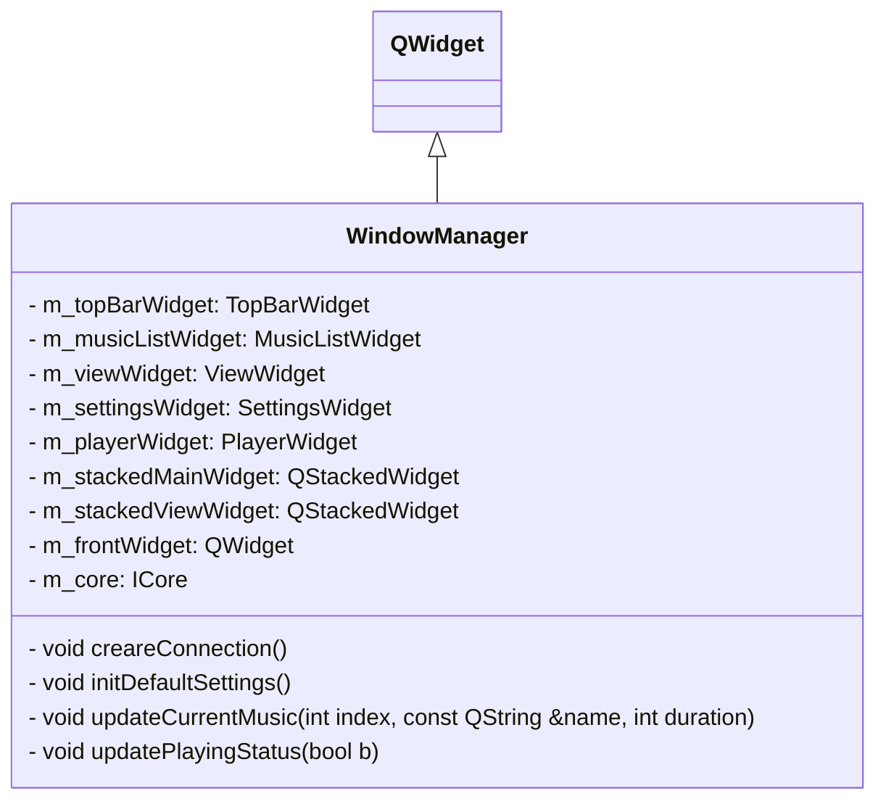
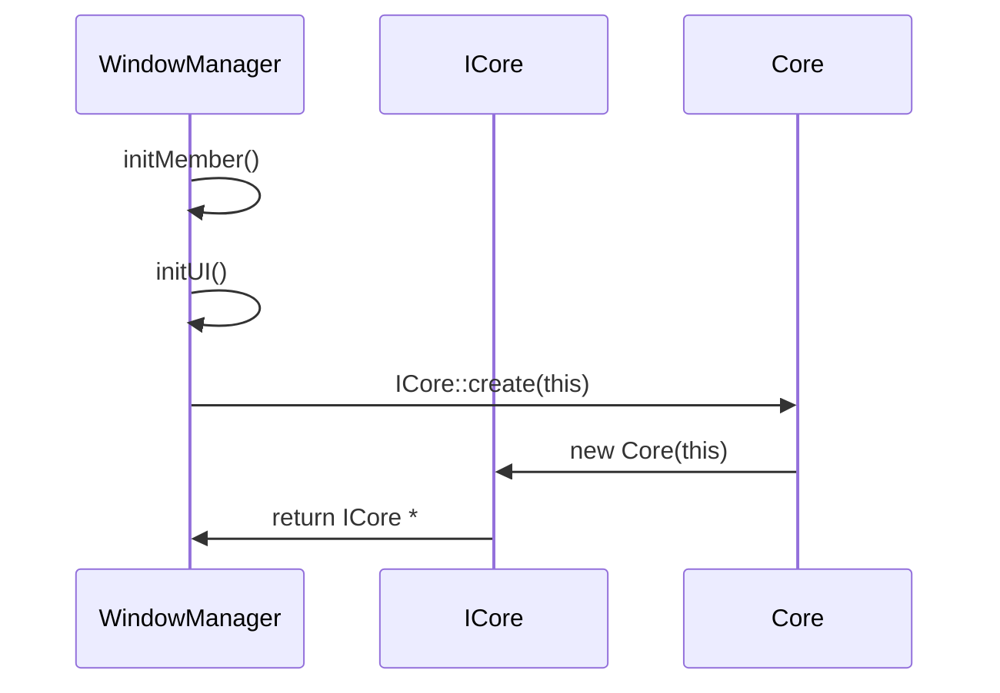
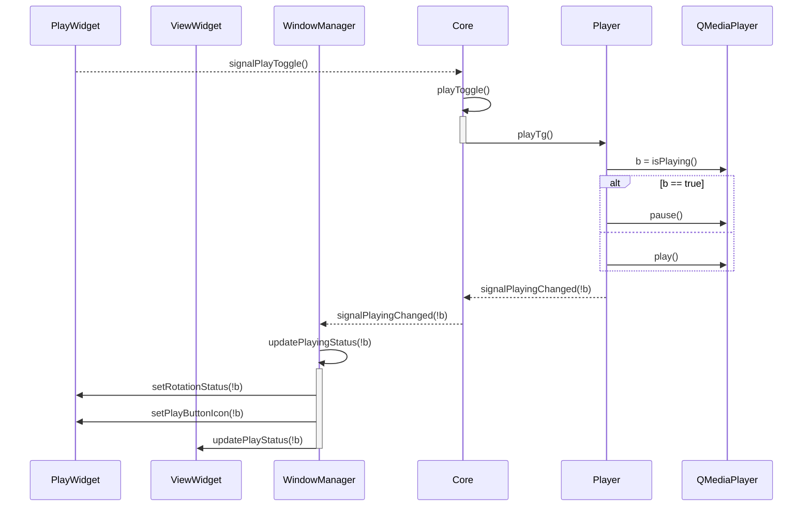
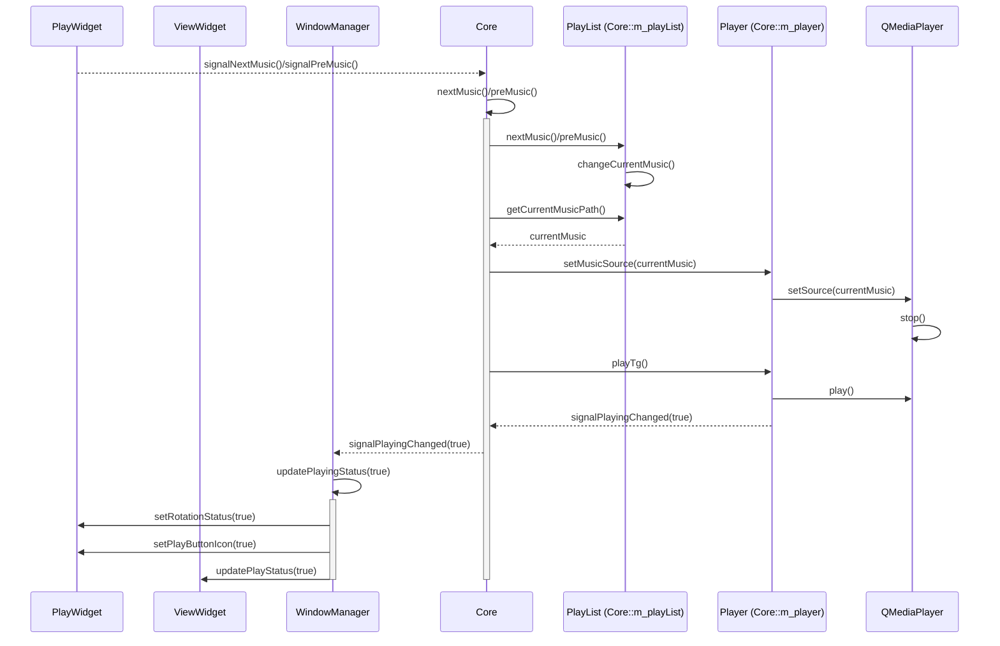

## WindowManager类

```mermaid
classDiagram

class WindowManager {
    - m_topBarWidget: TopBarWidget 
    - m_musicListWidget: MusicListWidget
    - m_viewWidget: ViewWidget
    - m_settingsWidget: SettingsWidget
    - m_playerWidget: PlayerWidget
    - m_stackedMainWidget: QStackedWidget
    - m_stackedViewWidget: QStackedWidget
    - m_frontWidget: QWidget
    - m_core: ICore 

    - void creareConnection()
    - void initDefaultSettings()
    - void updateCurrentMusic(int index, const QString &name, int duration)
    - void updatePlayingStatus(bool b)
}
QWidget <|-- WindowManager 
```

## 构造序列图

```mermaid
sequenceDiagram
    participant WindowManager
    participant ICore
    participant Core

    WindowManager ->> WindowManager: initMember()
    WindowManager ->> WindowManager: initUI()
    WindowManager ->> Core: ICore::create(this)
    Core ->> ICore: new Core(this)
    ICore ->> WindowManager: return ICore *

```

## 功能序列图

### PlayWidget

#### 播放/暂停

```mermaid
sequenceDiagram
    participant PlayWidget
    participant ViewWidget 
    participant WindowManager 
    participant Core
    
    
    PlayWidget -->> Core: signalPlayToggle()
    Core ->> Core: playToggle()
    activate Core
        Core ->> Player: playTg()
    deactivate Core
    Player ->> QMediaPlayer: b = isPlaying()
    alt b == true
        Player ->> QMediaPlayer: pause()
    else
        Player ->> QMediaPlayer: play()
    end
    Player -->> Core: signalPlayingChanged(!b)
    Core -->> WindowManager: signalPlayingChanged(!b)
    WindowManager ->> WindowManager: updatePlayingStatus(!b)
    activate WindowManager
        WindowManager ->> PlayWidget: setRotationStatus(!b)
        WindowManager ->> PlayWidget: setPlayButtonIcon(!b)
        WindowManager ->> ViewWidget: updatePlayStatus(!b)
    deactivate WindowManager
```

#### 上一曲/下一曲

```mermaid
sequenceDiagram
    participant PlayWidget
    participant ViewWidget 
    participant WindowManager 
    participant Core
    participant m_playList as PlayList (Core::m_playList)
    participant m_player as Player (Core::m_player)
    
    
    PlayWidget -->> Core: signalNextMusic()/signalPreMusic()
    Core ->> Core: nextMusic()/preMusic()
    activate Core
        Core ->> m_playList: nextMusic()/preMusic()
        m_playList ->> m_playList: changeCurrentMusic()
        Core ->>m_playList: getCurrentMusicPath()
        m_playList -->> Core: currentMusic 
        Core ->> m_player: setMusicSource(currentMusic)
        m_player ->> QMediaPlayer: setSource(currentMusic)
        QMediaPlayer ->> QMediaPlayer: stop()
        Core ->> m_player: playTg()
        m_player ->> QMediaPlayer: play()
        m_player -->> Core: signalPlayingChanged(true)
        Core -->> WindowManager: signalPlayingChanged(true)
        WindowManager ->> WindowManager: updatePlayingStatus(true)
        activate WindowManager
            WindowManager ->> PlayWidget: setRotationStatus(true)
            WindowManager ->> PlayWidget: setPlayButtonIcon(true)
            WindowManager ->> ViewWidget: updatePlayStatus(true)
        deactivate WindowManager
    deactivate Core


```