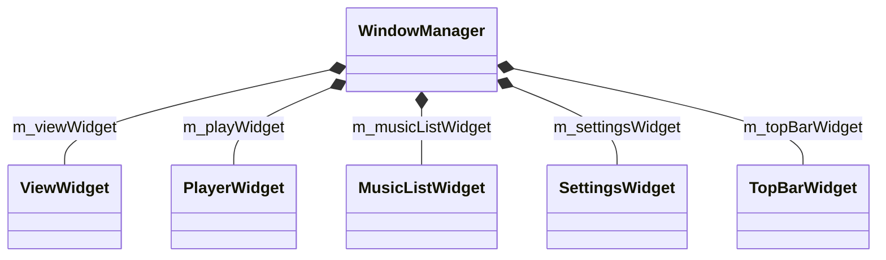
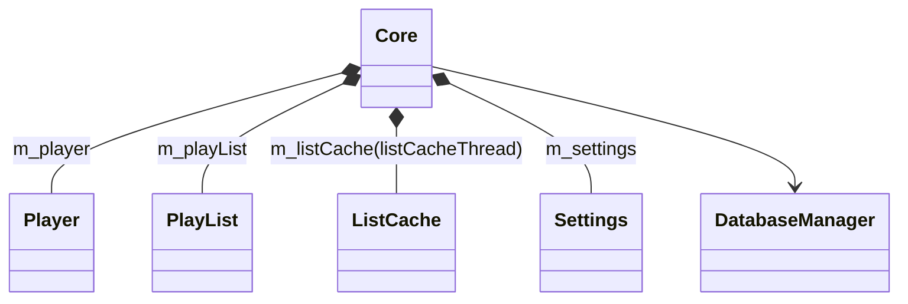
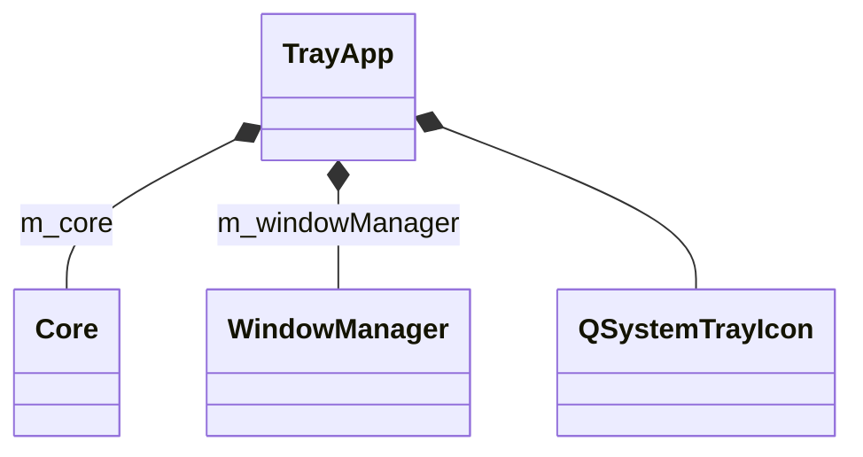

# 概览

## UI层

```mermaid
classDiagram

%% UI 层（界面类）
class WindowManager
class ViewWidget
class PlayerWidget
class MusicListWidget
class SettingsWidget
class TopBarWidget


WindowManager *-- ViewWidget : m_viewWidget
WindowManager *-- PlayerWidget : m_playWidget
WindowManager *-- MusicListWidget : m_musicListWidget
WindowManager *-- SettingsWidget : m_settingsWidget
WindowManager *-- TopBarWidget : m_topBarWidget

```

## Core层

```mermaid
classDiagram
%% Core 层（逻辑类）
class Core
class Player
class PlayList
class ListCache
class Settings
class DatabaseManager

Core *-- Player : m_player
Core *-- PlayList : m_playList
Core *-- ListCache : m_listCache(listCacheThread)
Core *-- Settings : m_settings
Core --> DatabaseManager

```

## Application

```mermaid
classDiagram
    class TrayApp
    class Core
    class WindowManager
    
    TrayApp *-- Core: m_core 
    TrayApp *-- WindowManager: m_windowManager
    TrayApp *-- QSystemTrayIcon

```