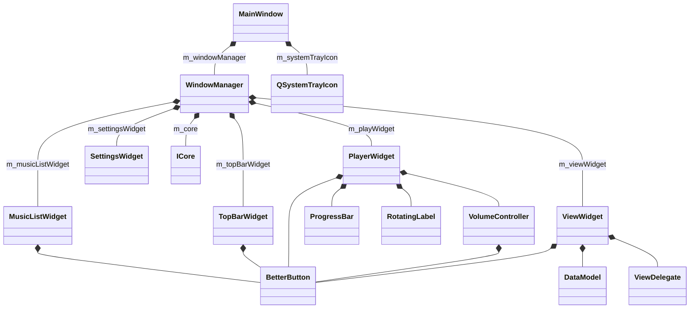
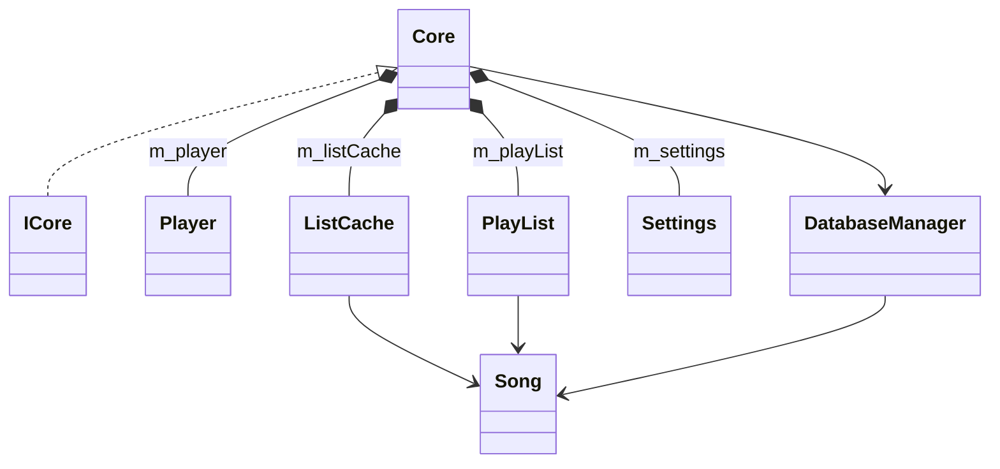

# 概览

## UI层

```mermaid
classDiagram

%% UI 层（界面类）
class MainWindow
class WindowManager
class QSystemTrayIcon
class ViewWidget
class PlayerWidget
class MusicListWidget
class SettingsWidget
class TopBarWidget


MainWindow *-- WindowManager : m_windowManager
MainWindow *-- QSystemTrayIcon : m_systemTrayIcon

WindowManager *-- ViewWidget : m_viewWidget
WindowManager *-- PlayerWidget : m_playWidget
WindowManager *-- MusicListWidget : m_musicListWidget
WindowManager *-- SettingsWidget : m_settingsWidget
WindowManager *-- TopBarWidget : m_topBarWidget

%% Panel 组件
class BetterButton
class DataModel
class ProgressBar
class RotatingLabel
class ViewDelegate
class VolumeController

MusicListWidget *-- BetterButton
TopBarWidget *-- BetterButton
PlayerWidget *-- BetterButton
VolumeController *-- BetterButton
ViewWidget *-- BetterButton

ViewWidget *-- DataModel
ViewWidget *-- ViewDelegate

PlayerWidget *-- ProgressBar
PlayerWidget *-- RotatingLabel
PlayerWidget *-- VolumeController

%% 表示 WindowManager 有一个 Core 指针成员
WindowManager *-- ICore : m_core

```

## Core层

```mermaid
classDiagram
%% Core 层（逻辑类）
class Core
class ICore
class Player
class PlayList
class ListCache
class Settings
class Song
class DatabaseManager


Core *-- Player : m_player
Core *-- PlayList : m_playList
Core *-- ListCache : m_listCache
Core *-- Settings : m_settings
Core --> DatabaseManager

ListCache --> Song
PlayList --> Song
DatabaseManager --> Song


Core <|.. ICore
```