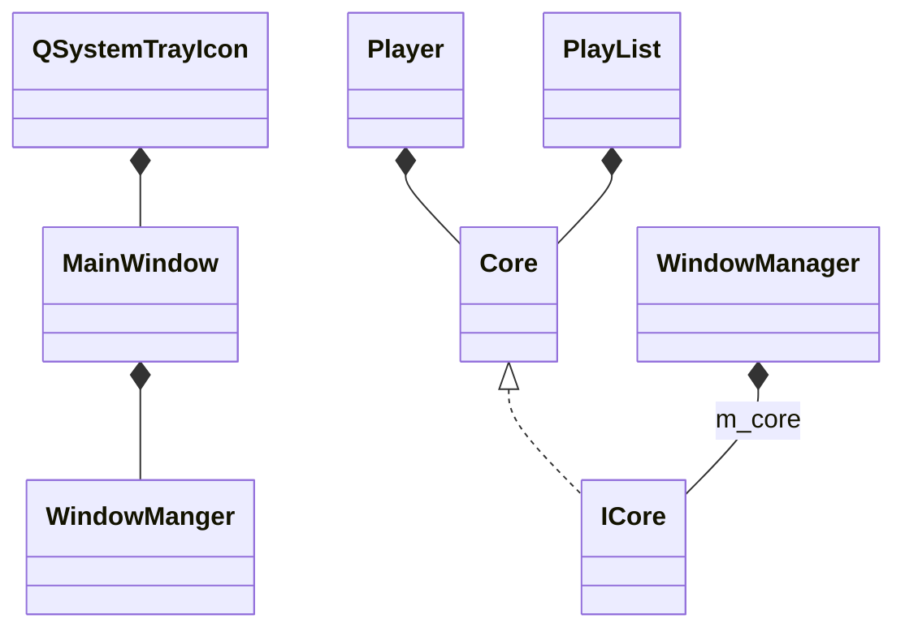

# 概览

```mermaid
classDiagram

%% UI 层（界面类）
class MainWindow
class WindowManager
class QSystemTrayIcon


MainWindow *-- WindowManger
QSystemTrayIcon *-- MainWindow 

%% Core 层（逻辑类）
class Core
class ICore
class Player
class PlayList


Player *-- Core
PlayList *-- Core


Core <|.. ICore
%% 表示 WindowManager 有一个 ICore 指针成员
WindowManager *-- ICore : m_core
```